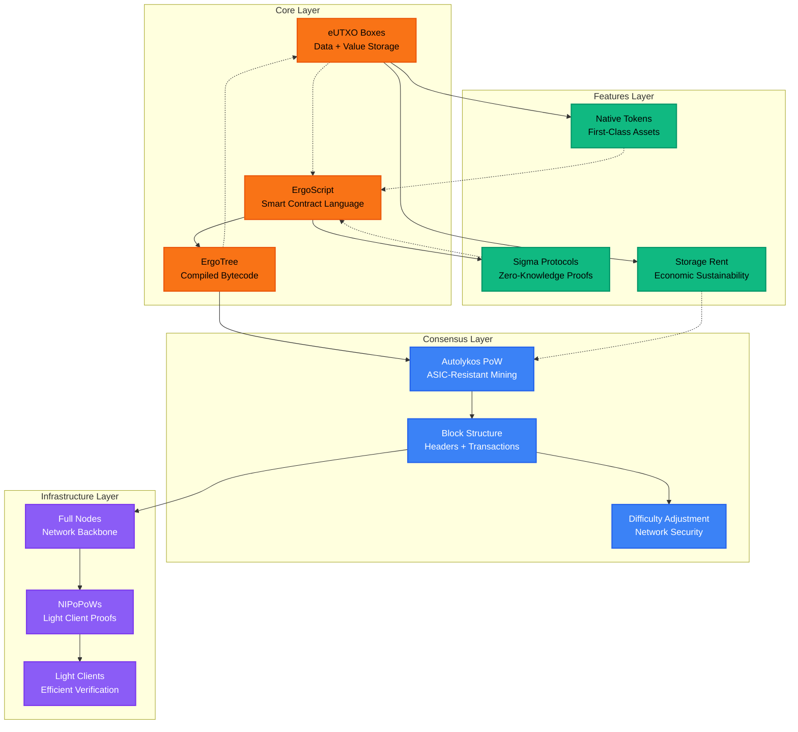
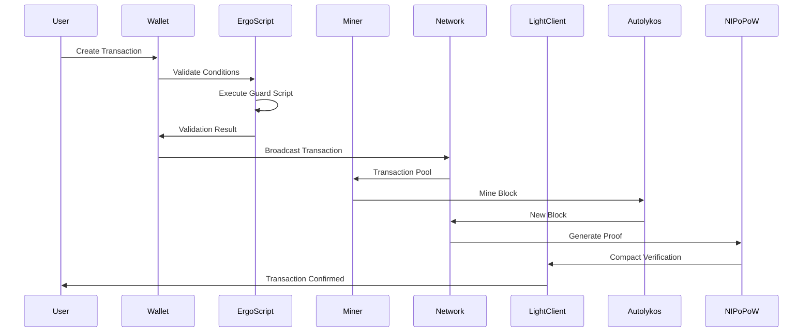
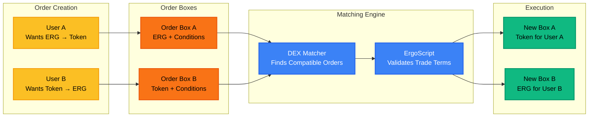
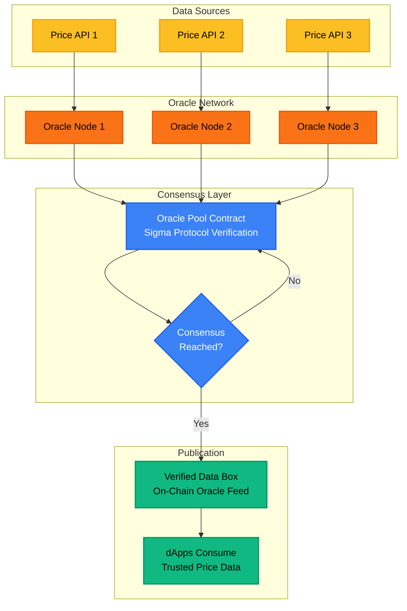
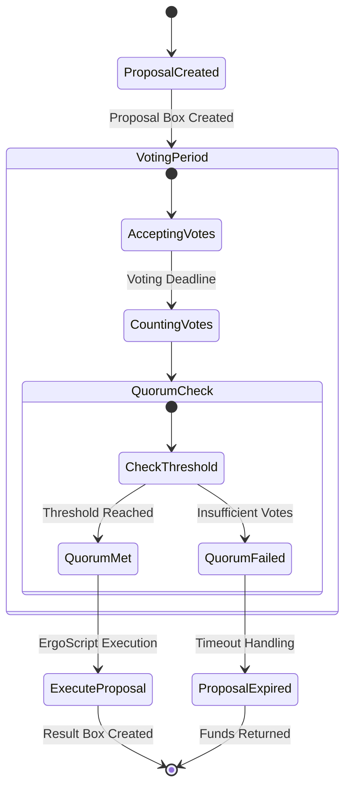
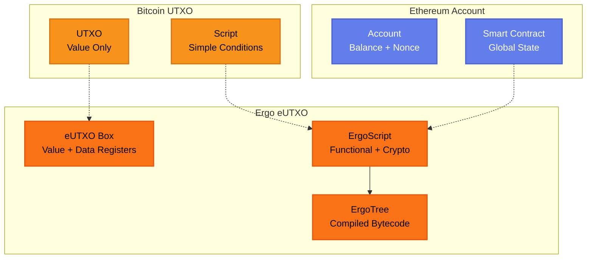

# Ergo Technology Interconnections - Diagrams

## Main Technology Interconnection Map

## Transaction Lifecycle Flow

## DEX Order Pattern

## Oracle Pool Consensus

## DAO Voting Mechanism

## eUTXO vs Account Model Comparison

## Diagram Accessibility

### Alt Text Descriptions

1. **Main Interconnection Map**: "Technology architecture diagram showing four layers: Core (eUTXO, ErgoScript, ErgoTree), Consensus (Autolykos, Blocks, Difficulty), Features (Sigma Protocols, Storage Rent, Native Tokens), and Infrastructure (Full Nodes, NIPoPoWs, Light Clients) with directional connections between components."

2. **Transaction Lifecycle**: "Sequence diagram showing transaction flow from User through Wallet, ErgoScript validation, Miner processing with Autolykos, Network consensus, NIPoPoW proof generation, to Light Client verification."

3. **DEX Pattern**: "Flow diagram showing atomic swap process: User A and B create order boxes, DEX matcher finds compatible orders, ErgoScript validates terms, resulting in new boxes with swapped assets."

4. **Oracle Pool**: "Consensus diagram showing multiple oracle nodes collecting data from APIs, submitting to pool contract with Sigma protocol verification, reaching consensus, and publishing verified data box for dApp consumption."

5. **DAO Voting**: "State diagram showing proposal lifecycle: creation, voting period, quorum check, and either execution or expiration based on threshold results."

## Technical Specifications Referenced

- EIP-0001: eUTXO Model Specification
- EIP-0006: Storage Rent Mechanism  
- Autolykos v2 Algorithm Paper
- NIPoPoW Research Paper (Kiayias et al.)
- Sigma Protocol Specification
- ErgoScript Language Reference
- Ergo Node API Documentation
